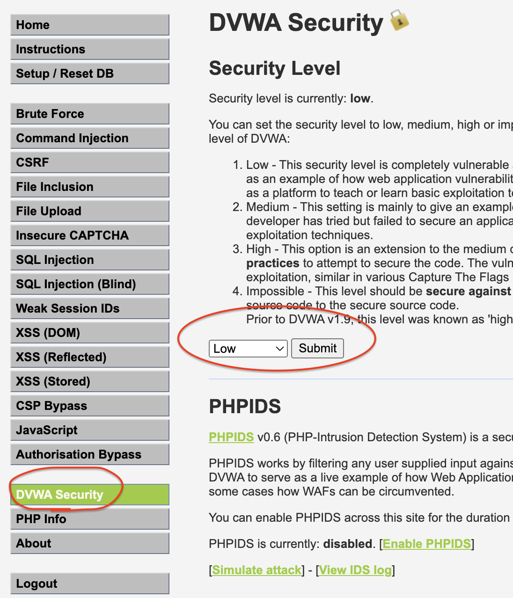
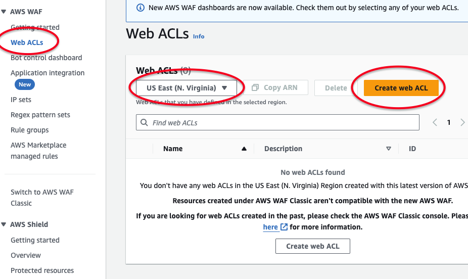
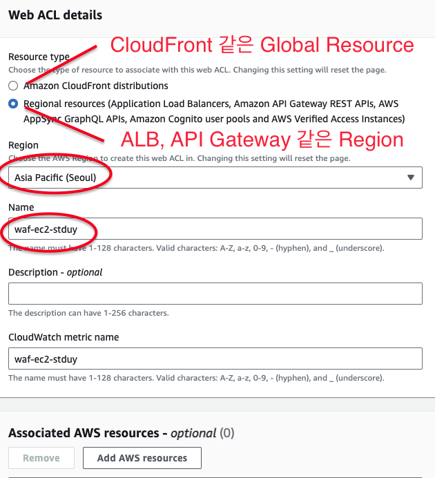
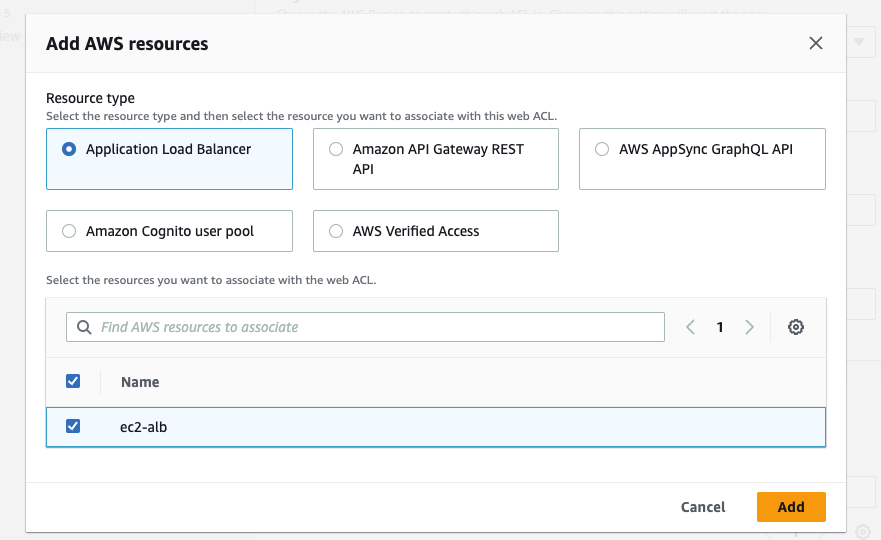
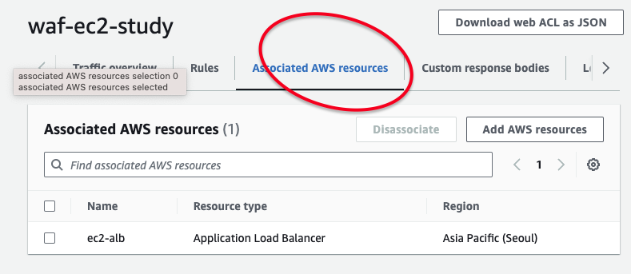
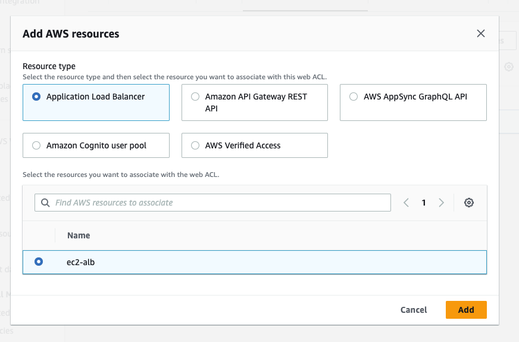
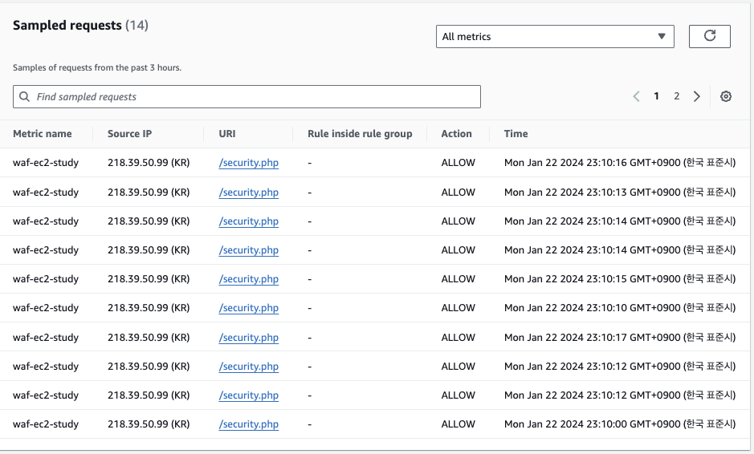

# WAF-Study


## dvwa

- DVWA는 취약하게 만든 웹 환경으로 구성되어 있으며 웹 모의해킹을 진행하기위해서 사용된다.
- dvwa id/pw

```yml
    ...
    MYSQL_ROOT_PASSWORD: rootpass
    MYSQL_DATABASE: dvwa
    MYSQL_USER: dvwa            ## id
    MYSQL_PASSWORD: p@ssw0rd    ## pw
    ...

    ## clear 후
    ## admin/password
```

## 초기설정



## WAF 설정 방법

ACL을 생성한다 (Default ACL)








## DVWA를 활용한 공격 방법 + ACL 설정

- [SQL_injection](./attacker/SQL_injection.md)

## Reference

- <a href="https://docs.aws.amazon.com/waf/latest/developerguide/getting-started.html"> WAF Getting Started </a>
